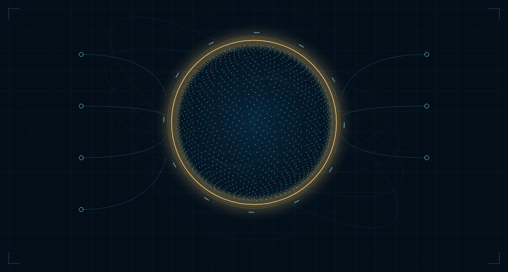
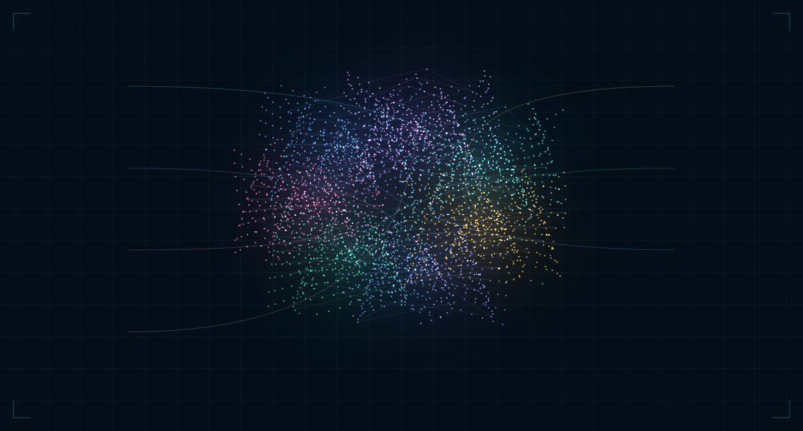
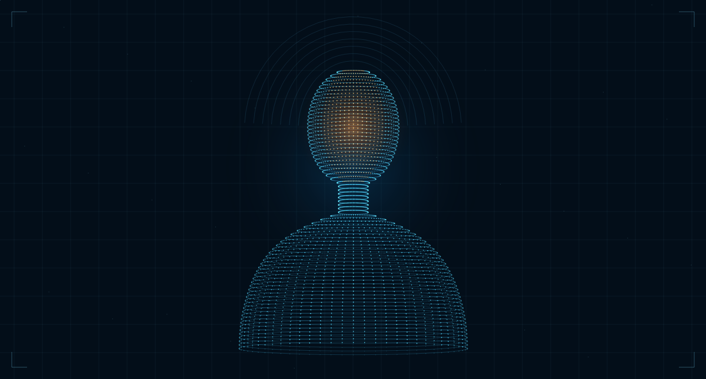

# Vistas del motor visual

Fotogramas de `desktop/ui/visuals.js` en calidad Detalle, a 1200 × 645.
Son renders del lienzo, no capturas del navegador: no incluyen las tarjetas HTML,
los controles ni datos privados. Las conexiones dibujadas son decoración.

## Órbita

## Mapa de módulos

## Presencia

Para regenerarlas, usa `node docs/previews/render.cjs` en un entorno de desarrollo
con `@napi-rs/canvas` instalado. Este paquete solo sirve para exportar las imágenes;
no forma parte de los requisitos del acompañante local ni se instala en tu Mac.
